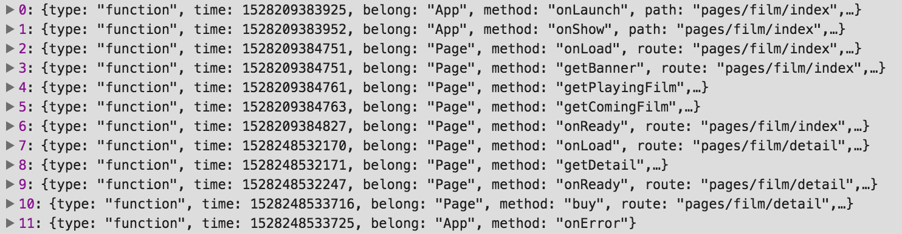

# xbossdebug  小程序bug监控工具

### 应用场景

1、监听线上未知错误

```
// 例如：调用错误
var result = {}
console.log(result.data.msg) // 抛出错误
```

2、记录错误执行堆栈，更方便重现错误




### 小程序使用

##### 1、引入资源

在app.js中加入，记得放在App对象上面

```
var xbossdebug = require('xbossdebug.js') // 引用xbossdebug
xbossdebug.apikey = 'maizuo' // apikey为自定义唯一值，用于后端记录时区分应用
xbossdebug.url = 'https://domain.com/'; // 上报服务端地址
```

##### 2、测试是否正常使用

```
App({
  onLaunch: function () {
    xbossdebug.notifyError('error')
  }
})
```

##### 3、控制台查看network，如果看到一个指向你配置url的请求，那就成功了。

```
// 发送的结构如下
{
    apikey: String // 应用唯一id
    breadcrumbs: Array // 函数执行面包线，方便用于错误重现
    error: String // 错误堆栈信息
    releseStage: String // 当前执行环境
    systemInfo: Object // 用户系统信息
    notifierVersion: String // 插件版本
    appVersion: String // 小程序版本
    locationInfo: Object // 用户位置信息
    userInfo: Object // 用户信息
    timing: Object // 页面加载耗时
}
```

##### 4、可选参数

```
xbossdebug.setSystemInfo = true; // 获取系统信息
xbossdebug.setUserInfo = true; // 获取用户信息
xbossdebug.setLocation = true; // 获取用户位置信息
xbossdebug.monitorMethodCall = true; // 监听用户自定义方法（默认只监听生命周期函数）
xbossdebug.methodWhitelist = ["foo", "bar"]; // 监听白名单 白名单和黑名单同时配置时，只应用白名单
xbossdebug.methodBlacklist = ["foo", "bar"]; // 监听黑名单
```


### [方案设计思想](https://github.com/zhengguorong/xbossdebug/blob/master/design.md)


### TODO

1. 服务端记录数据
2. 数据并可视化
3. 资源加载监控
4. 页面性能监控
5. typescript版本
6. 自动化测试


#### 声明

代码思想参考[fundebug](https://www.fundebug.com/)，如果大家觉得还不错，希望大家支持fundebug的saas服务。